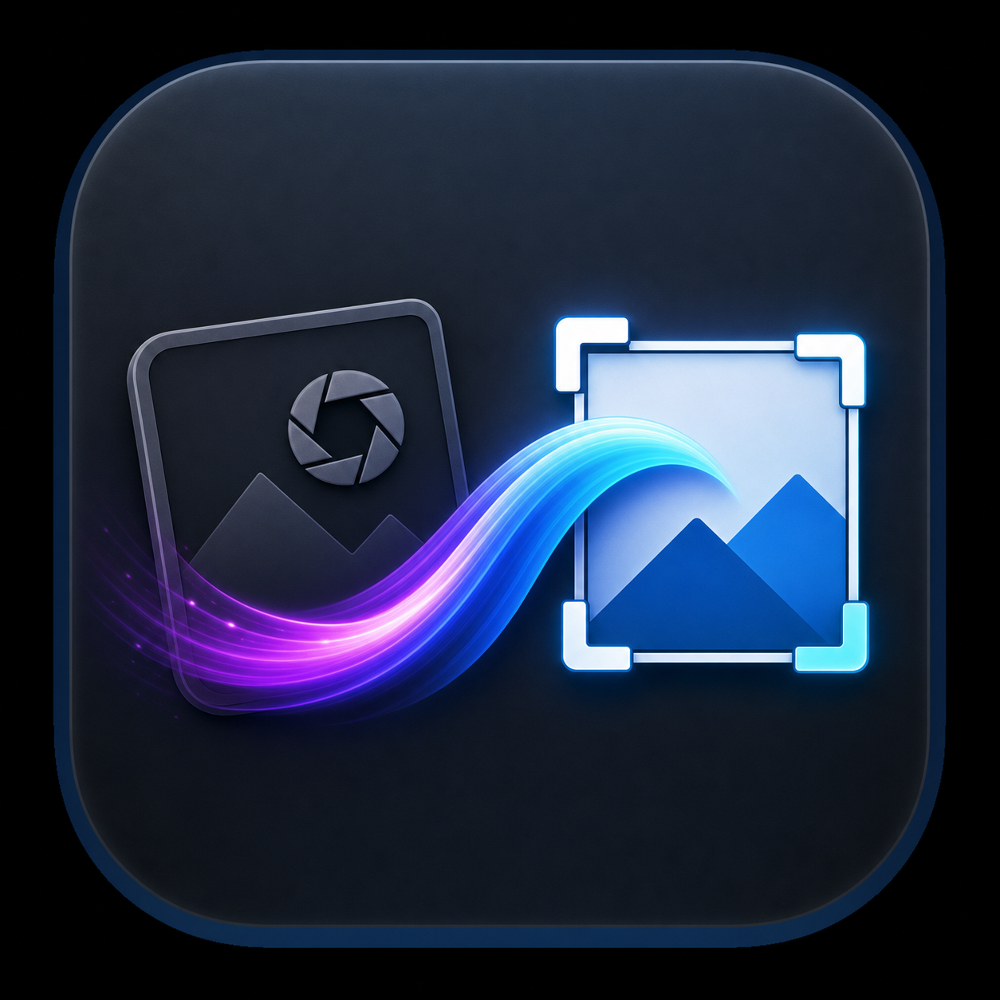

# Camera Toolkit

<p align="center">
  
</p>

Camera Toolkit is the native macOS app I use to move photos and video off my cameras, split a card into the events I actually shot, and get each event into a predictable editing and archive layout.

I built it because a camera card is not always one event. A single card can cover several shoots, and one event can span multiple cards or folders. I wanted to select those files quickly, save the event once, preview Sony RAW files without depending on Finder, and hand the resulting folders to Photomator or another editor without reorganizing everything by hand.

The safety rule is simple: the camera source stays read-only while browsing, previewing, copying, and archiving. Copy operations never overwrite conflicts, and archive operations verify checksums before reporting success. The sole destructive source action is an explicit **Free Up Camera** flow after verification; it re-hashes the complete selected set, requires typed confirmation, and removes nothing if any Buffer copy is missing or different.

## What I use it for

1. Plug in a camera card and browse it immediately.
2. Create or reopen an event, then select its photos across as many folders or cards as needed.
3. Preview the camera's embedded JPEGs, including supported Sony lossless-compressed `.ARW` files.
4. Copy only that event into a temporary workspace and verify every copied file.
5. Open the RAW files in Photomator and keep exports beside the event in a consistent layout.
6. Archive the verified originals into my long-term photo library without overwriting conflicts.
7. Optionally free the verified space on the camera after one final checksum recheck.

## What the app does

- Browses camera sources, buffer drives, photo-library folders, and ordinary local folders in one Finder-style window.
- Builds thumbnails and large previews from the JPEG embedded in supported Sony `.ARW` files, including lossless-compressed RAW variants that Finder may not preview.
- Opens the selected image with Space, moves through selections with the arrow keys, and opens a RAW in Photomator from the preview window.
- Saves events and assigns photos from multiple folders or camera cards to the same event.
- Shows a fast metadata-only import preview before any copy starts.
- Opens a separate persistent Transfer Queue window with per-file bytes copied, speed, verification state, and clear disconnect failures.
- Copies selected files to a buffer, verifies their checksums, then organizes verified originals into the photo library without overwriting conflicts.
- Offers **Free Up Camera** only for a completed, fully verified transfer. It shows the exact file count and size, requires typing `REMOVE`, rechecks every source/Buffer checksum, and permanently removes the source set only when all files still match.
- Stores event/file relationships in SQLite through [GRDB](https://github.com/groue/GRDB.swift) and includes a bounded, read-only SQL inspector.
- Checks whether known files already exist in Immich and stores per-event album/upload preferences. Photo upload is not enabled yet.

## Requirements

- macOS 14 or newer
- Swift 6 and Xcode 16 or newer for source builds
- Photomator is optional, but required for the preview window's **Open in Photomator** action
- An Immich server and API key are optional

## Build and run

From a clone of this repository:

```sh
swift test --jobs 1
swift run CameraToolkit
```

Package a locally ad-hoc-signed app bundle:

```sh
scripts/package-app.sh
open dist/CameraToolkit.app
```

To install that bundle into `/Applications`, run `scripts/package-app.sh --install`. Set `CAMERA_TOOLKIT_INSTALL_DIR` to install into a different directory.

## First-run setup

Open **Camera Toolkit → Settings** and choose:

1. One or more camera-source folders.
2. A temporary buffer folder.
3. A long-term photo-library root.
4. Optionally, an Immich server URL and API key.

No removable-drive, network-share, username, or home-directory path is compiled into the app. API keys are stored in macOS Keychain; paths and event preferences stay in the app's local configuration.

## Event workflow

1. Create or select an event.
2. Turn on selection mode and choose photos in any number of source folders.
3. Assign the collected photos to the event.
4. Use **Preview Event** for a quick path-and-size comparison.
5. Use **Copy Event + Verify** to copy the bytes into the buffer and checksum them.
6. Use **Archive + Verify** to organize verified originals in the library and write a manifest.
7. Optionally open **Transfers → Free Up Camera** to recheck and remove those exact files from the source device.

The default layout is intentionally readable:

```text
Buffer/<year>/<event>/
├── <camera>/Card Copy/
├── Photomator/
└── Exports/
    ├── Masters/
    ├── Web/
    └── Social/

Photo Library/Originals/<year>/<event>/<camera>/
├── RAW/
├── Photos/
├── Video/
└── Other/
```

## Keyboard shortcuts

| Shortcut | Action |
| --- | --- |
| Space | Preview the selected file |
| Arrow keys | Move through files or the preview selection |
| Command-B | Toggle the locations sidebar |
| Command-Plus / Command-Minus | Increase or decrease thumbnail size |
| Command-C | Copy selected file references |
| Command-A | Select all files |
| Command-R | Refresh |
| Option-Command-E | Open Event Library |
| Shift-Command-I | Open the SQLite inspector |
| Shift-Command-K | Open the full shortcut reference |

## Safety model

- Camera browsing, previews, copies, and archives are source-read-only.
- **Free Up Camera** is the only source-destructive action. It is available only after full Buffer verification, requires typing `REMOVE`, performs a fresh all-files checksum pass, and permanently removes nothing when any file fails that pass.
- Metadata previews do not claim checksum verification.
- Copy and archive paths refuse to overwrite a different existing file.
- Archive success requires checksum verification and writes a manifest.
- Buffer-to-archive cleanup moves verified Buffer files into a recoverable `_Trash/<batch>` area; permanent Buffer-trash deletion remains separate and confirmation-gated.
- Tests operate only in temporary directories.

See [Safety](docs/SAFETY.md), [Configuration](docs/CONFIGURATION.md), and [Architecture](docs/ARCHITECTURE.md) for implementation details.

## Project status

Camera Toolkit is early-stage macOS software. The local browsing, preview, event, verified-copy, archive, catalog, and Immich-presence paths are implemented. App signing/notarization and Immich uploads are not implemented.

Contributions are welcome; start with [CONTRIBUTING.md](CONTRIBUTING.md). Camera Toolkit is available under the [MIT License](LICENSE).
