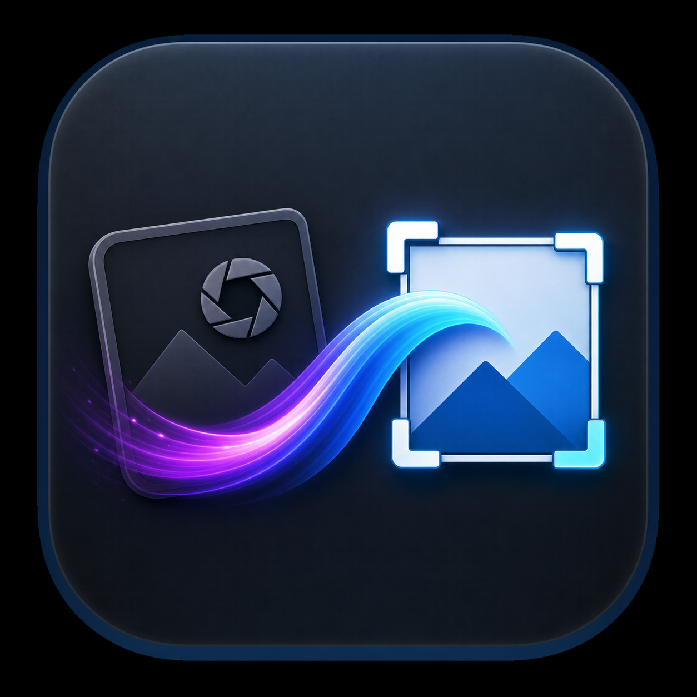

# Camera Toolkit

<p align="center">
  
</p>

Camera Toolkit is the native macOS app I use to move photos and video off my cameras, split everything into the events I actually shot, and know where each event lives: on the card, on the working drive, on the NAS, and in Immich.

I built it because a camera card is not always one event. A single card can cover several shoots, one event can span multiple cards, and on a trip I often just dump cards into folders and sort later. I wanted to see those dumps as bursts and days, sort them into events with a keypress, keep private events off the drive my family browses, and get everything archived without reorganizing folders by hand.

The safety rule is simple: sorting only records assignments, moves on the same drive are renames that never overwrite anything, copies to other drives are checksum-verified, and anything destructive re-hashes the whole set and asks for typed confirmation first.

## What I use it for

New here? Press **Start Guided Setup** on the welcome screen, or **Guide** in the sidebar. It checks the Buffer, private folder, and NAS, finds unsorted photo folders on connected drives, adds event folders already on the drive, and walks through sorting and applying a first burst.

1. Add a card or an unsorted folder. The app groups bursts and splits the shots by day using each camera's own clock.
2. Select photos and press 1–3 for a recent event, drag them onto an event, or press N to make a new event. **Event…** searches every event by name.
3. Mark an event **Private · NAS only** when it should never sit in the shared Buffer.
4. Press **Apply**. Files already on the working drive move into their event folders instantly; files on a card are copied and verified.
5. Open an event and use its storage strip: **Archive to NAS**, **Take Off Drive**, **Free Up Source**, and **Upload** to Immich.
6. Edit the RAW files in Photomator straight from the event.

## What the app does

- Opens on **Events**: unsorted folders and cards on the left, events below them, and a burst board or event view on the right. The original Finder-style browser is still one click away as **File Browser**.
- Reads capture times from a small block of each RAW header, remembers them, pairs sidecars and RAW+JPEG twins, trusts existing `B0001_` burst prefixes, and chains still frames shot within a second.
- Shows every capture day as its own section with large thumbnails, a burst count badge, and a full-size preview with a filmstrip for every frame.
- Sorts with number keys, drag and drop, or a context menu, with Command-Z undo. Nothing moves until Apply shows its plan.
- Keeps shared events in the Buffer and private events in a hidden staging folder on the same drive, and moves an event between the two when its policy changes.
- Shows, for every event, how many files are on the card or unsorted folder, on the drive, on the NAS, and in Immich, with one action for each.
- Finds event folders that were already organized on the drive by hand and adds them as events without moving anything.
- Journals every move so **Undo** can put files back.
- Uploads event originals to Immich with a streamed multipart body, skips content Immich already has, and adds the uploads to an event or custom album.
- Builds thumbnails and large previews from the JPEG embedded in supported Sony `.ARW` files, including lossless-compressed RAW variants that Finder may not preview.
- Opens a separate persistent Transfer Queue window with per-file bytes copied, speed, verification state, and clear disconnect failures.
- Runs sequential storage speed tests inside the app: camera/card sources are read-only, while Buffer/library targets use a flushed, uncached, automatically removed temporary file.
- Stores event/file relationships in SQLite through [GRDB](https://github.com/groue/GRDB.swift) and includes a bounded, read-only SQL inspector.
- Labels macOS network-share capacity as an SMB estimate and can securely query the matching TrueNAS dataset and pool for authoritative free space and health.

## Requirements

- macOS 14 or newer
- Swift 6 and Xcode 16 or newer for source builds
- Photomator is optional, but required for the **Open in Photomator** actions
- An Immich server and API key are optional
- A TrueNAS server and read-only API key are optional when exact NAS capacity is needed

## Build and run

From a clone of this repository:

```sh
swift test --jobs 1
swift run CameraToolkit
```

Package a locally ad-hoc-signed app bundle:

```sh
scripts/package-app.sh
open dist/CameraToolkit.app
```

To install that bundle into `/Applications`, run `scripts/package-app.sh --install`. Set `CAMERA_TOOLKIT_INSTALL_DIR` to install into a different directory.

### Rebuild a catalog from existing folders

`CameraToolkitCatalogRebuilder` is a non-destructive maintenance command for
recovering or reconciling an existing Camera Toolkit installation. It reads an
event plan, scans every source with the same `FileScanner` used by the app, and
writes separate candidate configuration and SQLite files. It preserves events
outside the plan and replaces only assignments for source roots named by the
plan. It never moves or deletes media and refuses to overwrite candidate files.

```sh
swift run CameraToolkitCatalogRebuilder \
  --configuration /path/to/config.json \
  --plan /path/to/event-plan.json \
  --output-configuration /path/to/config.candidate.json \
  --output-catalog /path/to/catalog.candidate.sqlite
```

Review and validate the candidates before installing them. Filesystem copying
and checksum verification are deliberately separate operations.

## First-run setup

Open **Camera Toolkit → Settings** and choose:

1. A Buffer folder on the working drive.
2. A long-term photo-library root, such as a mounted NAS share.
3. Optionally, a private staging folder. Leave it empty to use a hidden `.Camera Toolkit/Private` folder on the Buffer drive.
4. Optionally, an Immich server URL and API key.
5. Optionally, a TrueNAS server URL and read-only API key. Leave the dataset blank to match it from the mounted SMB library share.

Then add cards and unsorted folders from the Events sidebar with **Add Folder or Card…**. No removable-drive, network-share, username, or home-directory path is compiled into the app. API keys are stored in macOS Keychain; paths and event preferences stay in the app's local configuration.

## Event workflow

1. Add an unsorted folder or card and select it in the sidebar.
2. Select bursts or single photos. Use **Select Day** to take a whole day at once.
3. Press a number key for one of the nine most recent events, drag onto any event, or press N to create one.
4. Press **Apply** and review the plan. Same-drive files move; card files copy with verification.
5. Open the event. Choose **Shared Buffer** or **Private · NAS only**.
6. **Archive to NAS** copies with SHA-256 verification. **Take Off Drive** then re-hashes against the NAS and moves the drive copies to the drive's hidden `_Trash`.
7. **Free Up Source** re-hashes card originals against their drive copies before removing them.
8. Turn on **Send to Immich** and press **Upload** for events you want in Immich.

The layout is intentionally readable:

```text
Buffer/<year>/<yyyy-MM-dd event>/
└── <camera>/Card Copy/

<drive>/.Camera Toolkit/
├── Private/<year>/<yyyy-MM-dd event>/<camera>/Card Copy/
└── _Trash/<batch>/

Photo Library/Originals/<year>/<yyyy-MM-dd event>/<camera>/
├── RAW/
├── JPEG/
├── Video/
└── Camera Support/
```

## Keyboard shortcuts

| Shortcut | Action |
| --- | --- |
| 1–3 | Sort the selection into that recent event |
| N | New event from the selection |
| Delete | Unsort the selection |
| Arrow keys | Move between items; hold Shift to extend the selection |
| Space | Preview the selected burst; ← → step frames, ↑ ↓ move between items |
| Command-Z | Undo the last sort |
| Command-A | Select everything shown |
| Option-Command-1 / Option-Command-2 | Switch between Events and File Browser |
| Command-R | Refresh |
| Option-Command-E | Open Event Library |
| Shift-Command-I | Open the SQLite inspector |
| Shift-Command-K | Open the full shortcut reference |

## Safety model

- Sorting records assignments only. Apply shows a plan before anything moves.
- Same-drive moves are exclusive renames that never overwrite a file, and every move is journaled for Undo.
- Copies to another drive are checksum-verified and leave the original in place.
- **Take Off Drive** requires a matching NAS copy, typed confirmation, and a fresh checksum pass over the whole set, and it moves files to a recoverable `_Trash` batch instead of deleting them.
- **Free Up Camera** and **Free Up Source** are the only source-destructive actions. They require typing `REMOVE`, perform a fresh all-files checksum pass, and remove nothing when any file fails.
- Archive success requires checksum verification and writes a manifest.
- Private staging is hidden from Finder but is not encrypted or access-controlled.
- Tests operate only in temporary directories.

See [Safety](docs/SAFETY.md), [Configuration](docs/CONFIGURATION.md), and [Architecture](docs/ARCHITECTURE.md) for implementation details.

## Project status

Camera Toolkit is early-stage macOS software. The event organizer, local browsing, preview, verified-copy, archive, catalog, and Immich upload paths are implemented. Immich upload is covered by tests against a recording transport. App signing and notarization are not implemented.

Contributions are welcome; start with [CONTRIBUTING.md](CONTRIBUTING.md). Camera Toolkit is available under the [MIT License](LICENSE).
